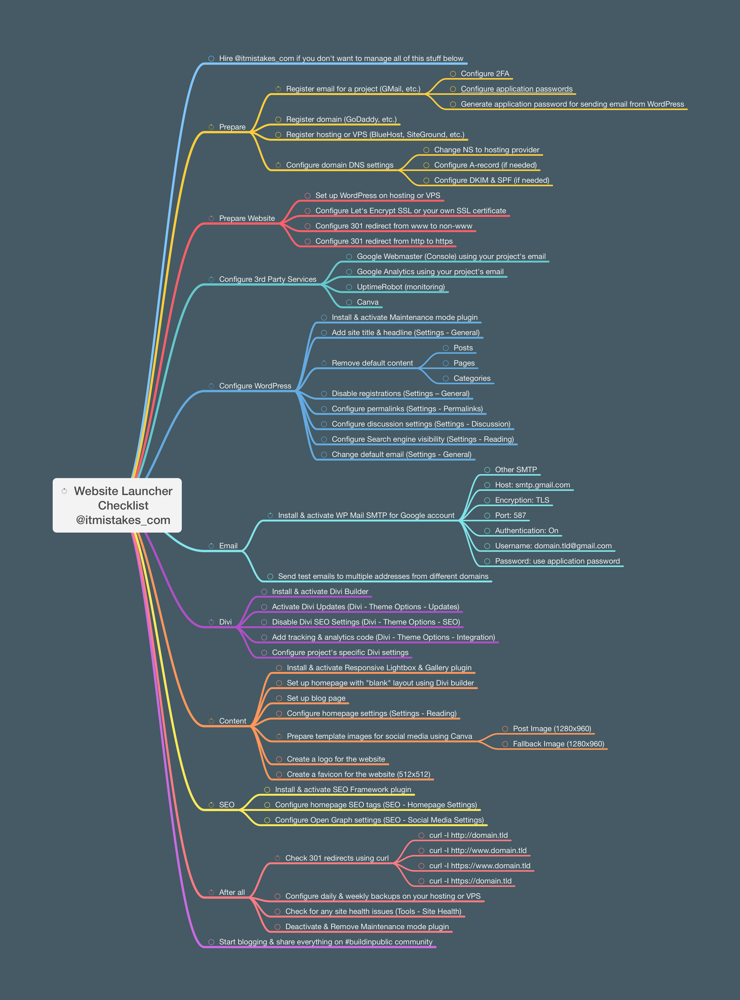

# WordPress Step-by-Step

Launching your fully prepared WordPress website in just one day? 🤔

Check out this mind map for the step-by-step guide!

This repository is made for the [#buildinpublic](https://twitter.com/hashtag/buildinpublic) community by [@itmistakes_com](https://twitter.com/itmistakes_com).

## Prepare

- [ ] Register email for a project (GMail, etc.)
  - [ ] Configure 2FA
  - [ ] [Configure application passwords](https://support.google.com/mail/answer/185833?hl=en)
  - [ ] Generate application password for sending email from WordPress
- [ ] Register domain (GoDaddy, etc.)
- [ ] Register hosting or VPS (BlueHost, SiteGround, etc.)
- [ ] Configure domain DNS settings
  - [ ] Change NS to hosting provider
  - [ ] Configure A-record (if needed)
  - [ ] Configure DKIM & SPF (if needed)

## Prepare Website

- [ ] Set up WordPress on hosting or VPS
- [ ] Configure Let's Encrypt SSL or your own SSL certificate
- [ ] Configure 301 redirect from www to non-www
- [ ] Configure 301 redirect from http to https

## Configure 3rd Party Services

- [ ] [Google Webmaster](https://developers.google.com/) (Console) using your project's email
- [ ] [Google Analytics](https://marketingplatform.google.com/about/analytics/) using your project's email
- [ ] [UptimeRobot](https://uptimerobot.com/) (monitoring)
- [ ] [Canva](https://canva.com/)

## Configure WordPress

- [ ] Install & activate Maintenance mode plugin
- [ ] Add site title & headline (Settings - General)
- [ ] Remove default content
  - [ ] Posts
  - [ ] Pages
  - [ ] Categories
- [ ] Disable registrations (Settings – General)
- [ ] Configure permalinks (Settings - Permalinks)
- [ ] Configure discussion settings (Settings - Discussion)
- [ ] Configure Search engine visibility (Settings - Reading)
- [ ] Change default email (Settings - General)

## Email

- [ ] Install & activate [WP Mail SMTP](https://wordpress.org/plugins/wp-mail-smtp/) for Google account
  - [ ] Other SMTP
  - [ ] Host: smtp.gmail.com
  - [ ] Encryption: TLS
  - [ ] Port: 587
  - [ ] Authentication: On
  - [ ] Username: domain.tld@gmail.com
  - [ ] Password: use application password
- [ ] Send test emails to multiple addresses from different domains

## Divi

- [ ] Install & activate [Divi Builder](https://www.elegantthemes.com/gallery/divi/)
- [ ] Activate Divi Updates (Divi - Theme Options - Updates)
- [ ] Disable Divi SEO Settings (Divi - Theme Options - SEO)
- [ ] Add tracking & analytics code (Divi - Theme Options - Integration)
- [ ] Configure project's specific Divi settings

## Content

- [ ] Install & activate [Responsive Lightbox & Gallery](https://wordpress.org/plugins/responsive-lightbox/) plugin
- [ ] Set up homepage with "blank" layout using Divi builder
- [ ] Set up blog page
- [ ] Configure homepage settings (Settings - Reading)
- [ ] Prepare template images for social media using Canva
  - [ ] Post Image (1280x960)
  - [ ] Fallback Image (1280x960)
- [ ] Create a logo for the website
- [ ] Create a favicon for the website (512x512)

## SEO

- [ ] Install & activate [SEO Framework](https://wordpress.org/plugins/autodescription/) plugin
- [ ] Configure homepage SEO tags (SEO - Homepage Settings)
- [ ] Configure Open Graph settings (SEO - Social Media Settings)

## After all

- [ ] Check 301 redirects using curl
  - [ ] `curl -I http://domain.tld`
  - [ ] `curl -I http://www.domain.tld`
  - [ ] `curl -I https://www.domain.tld`
  - [ ] `curl -I https://domain.tld`
- [ ] Configure daily & weekly backups on your hosting or VPS
- [ ] Check for any site health issues (Tools - Site Health)
- [ ] Deactivate & Remove Maintenance mode plugin

## Start blogging

Share everything with the #buildinpublic community on Twitter 👏
